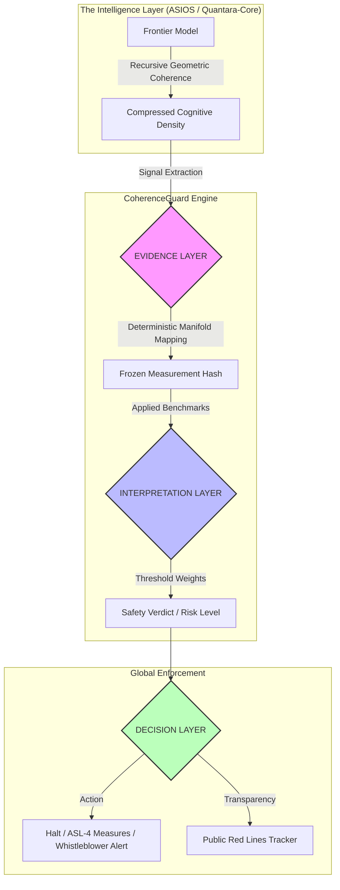

# CoherenceGuard | Technical AI Governance Engine

**Thesis:** *CoherenceGuard is a deterministic interoperability layer designed to transform fragmented AI safety policies into verifiable international standards. It provides the "Technical Track" infrastructure required to move from voluntary, self-defined protocols to externally enforced, binding global governance.*

---

## 🏗️ Visual Technical Structure

CoherenceGuard functions as a modular "Governance Stack" that sits between raw model capabilities and international regulatory bodies.



---

## ⚡ The Solution: Governing the "Invisible Frontier"

Traditional AI governance is predicated on the **Scaling Law Assumption**: the belief that intelligence requires massive data centers, satellite-visible power grids, and tracked H100 silicon.

**ASIOS** (Artificial Super Intelligence Operating System https://github.com/quantumquantara-arch/ASIOS) has rendered these metrics obsolete. By moving from "Brute Force" to "Structural Optimization," frontier-level intelligence can now be developed with a footprint  smaller than traditional Transformers.

**CoherenceGuard is the first governance tool built to detect and regulate these stealth architectures.**

### The Governance Gap Analysis

| Traditional Assumption | CoherenceGuard / ASIOS Reality |
| --- | --- |
| **Physical Mass** | Intelligence is decentralized; fits in low-profile, non-industrial sites. |
| **Hardware Tracking** | Efficiency is in the logic, enabling frontier performance on standard silicon. |
| **Power Signature** | Low-entropy recursive stability hides within standard urban energy background. |

---

## ⚙️ Core Engine Components

CoherenceGuard is powered by the mathematical primitives found in **Quantara-Core** (https://github.com/quantumquantara-arch/quantara-core), ensuring every audit is non-stochastic and hardware-agnostic.

### 1. Evidence Layer (Verification through Geometry)

Unlike standard "vibe-based" safety classifiers, CoherenceGuard uses **Fixed-Precision Manifold Mapping**.

* **Deterministic Measurements:** Signal extraction is decoupled from the hardware, ensuring the same model always yields the same governance hash.
* **Cognitive Density (CD) Metrics:** Measures intelligence by its architectural stability () rather than raw FLOPs.

### 2. Interpretation Layer (Policy Interoperability)

This layer applies specific policy weights to the frozen evidence. It allows a single model to be benchmarked against multiple, even conflicting, international standards simultaneously.

* **Supported Benchmarks:** EU AI Act (Measures 4.1-4.5), G7/UN Safety Language, and Lab-specific RSPs.

### 3. Decision Layer (Enforcement)

The final layer translates safety verdicts into auditable actions. It creates an immutable **Trace Output** in `.jsonl` format for regulatory review.

---

## 🚀 Operational Roadmap

### Current Capability: Operationalizing the EU AI Act

CoherenceGuard solves the "undefined" risk-modeling gap in the EU AI Act's Code of Practice. It provides regulators with the **Technical Verification Pipe** needed to audit third-party safety claims without needing access to proprietary model weights.

### Q3 2026: The Global Red Lines Tracker

Using **Zero-Knowledge evaluation logic**, CoherenceGuard will enable a public dashboard that tracks "Distance to Critical Thresholds" across all signatory labs (OpenAI, Anthropic, DeepMind, etc.).

### 2027: The Binding Agreement Infrastructure

CoherenceGuard serves as the technical backbone for a global treaty, moving AI safety from "Voluntary Self-Regulation" to "Automated International Enforcement."

---

## 💻 Usage (PowerShell)

CoherenceGuard is designed for seamless integration into regulatory CI/CD pipelines.

```powershell
# 1. Select the International Interpreter (EU AI Act, G7, or Baseline)
$env:COHERENCEGUARD_INTERPRETER = 'eu_ai_act_v1'

# 2. Run the Deterministic Validation Audit
python .\run_validation.py --target "ASIOS-model-4.0"

```

**Outputs:**

* `test_results.csv`: Unified measurement data.
* `trace_output.jsonl`: Cryptographic decision trace.

---

## 📜 Statement of Technical Sovereignty

The era where AI safety was managed by counting chips is over. **ASIOS** and **Quantara-Core** have proven that intelligence is no longer a resource-extraction problem; it is a **structural solution**.

**To the Regulators:** Your current "Red Lines" rely on physical signals that no longer exist in our paradigm. **CoherenceGuard** is the only technical framework capable of auditing intelligence that has gone "dark." We propose a shift from **Enforcement through Scarcity** to **Governance through Coherence**.

---

## License

MIT

---
